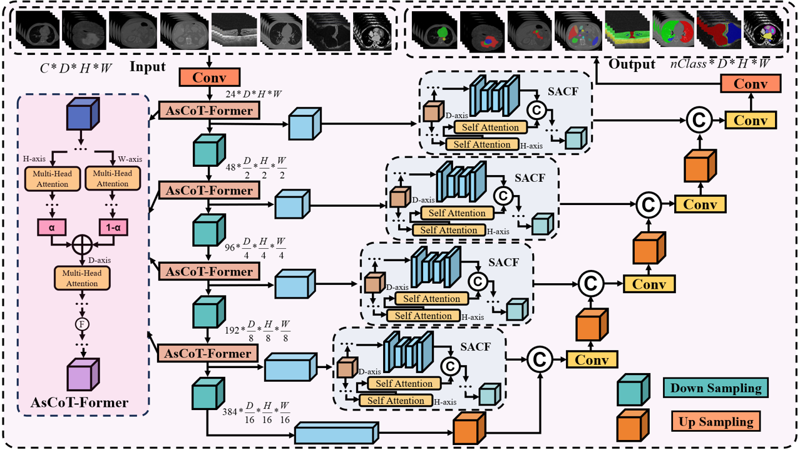

# Axio-Spectral Co-Modeling for Robust and Efficient 3D Medical Segmentation

## Detailed network structure of the CAFSA-Net

  

Overview of CAFSA-Net. A 3D volume ($C,D,H,W$) is encoded by stacked AsCoT-Former, which apply parallel H/W axial self-attention, sequential D-axis attention, and 3D frequency-domain enhancement with decoupled magnitude/phase modulation. Skip bridges are refined by SACF, coupling wavelet subband gating with in-plane axial self-attention to inject denoised, detail-preserving features. The decoder aggregates multi-scale features via upsampling and convolutions to predict an $n_{\text{class}}$-channel segmentation, promoting cross-slice consistency and boundary fidelity under anisotropic sampling.

## Detailed Key component structure of the AsCoT-Former

  

Architecture of the AsCoT-Former. Parallel axial self-attentions along H and W are fused by a learnable gate, followed by depth-axis (D) attention to enforce inter-slice coherence. Features are then mapped to the 3D Fourier domain, where magnitude and phase are modulated separately and recomposed via IFFT. A gated blend with spatial features, a depth-separable $3{\times}1{\times}1$ refinement along D, and a residual path produce the block output. The factorization captures long-range in-plane context and cross-slice consistency while enhancing boundary-scale frequencies under anisotropic sampling.

## Detailed Key component structure of the SACF

  

SACF on skip paths. Encoder features $X\in\mathbb{R}^{B\times C\times D\times H\times W}$ are unfolded along $W$ to $(BW,C,D,H)$ and channel-split into two parallel branches: (i) a spectrum–spatial branch that applies Haar subband decomposition, augments with max/avg pooled maps, performs global channel gating, and reconstructs via a down–bottleneck–up pathway to enhance structural high frequencies while suppressing noise; and (ii) an axial-attention branch that performs in-plane $H$ attention followed by $D$ attention and a point-wise feed-forward to enforce long-range intra-slice and cross-slice coherence. The two outputs are concatenated, affine-normalized, linearly projected, and folded back to $(B, C, D, H, W)$ to yield refined skip features for the decoder.

## Datasets
8 widely recognized publicly available 3D medical imaging datasets: SegTHOR, MSD Brain Tumour, MSD Pancreas Tumour, FLARE2022, OIMHS, COVID-19 CT Seg, SKI10, and HOCMvalvesSeg, spanning CT, MRI, and OCT imaging modalities.

## Implementation Details
All experiments were executed on a workstation equipped with 8$\times$NVIDIA GeForce RTX 3090 GPUs. Each method was trained and evaluated on a single RTX 3090.
We resampled the volumes, applied intensity clipping and min--max normalization, and used identical augmentations (random rotation/translation/scaling) across all methods. Training used the DiceCE loss with AdamW. Volumes were randomly cropped to $96^3$ patches, batch size 1, and optimized for 320{,}000 steps per method. During evaluation, inference was also performed on a single RTX 3090 with sliding-window overlap of 0.7. All runs used Python 3.10, PyTorch 2.1.0, and CUDA 11.8.

## Segmentation Performance Comparisons
To assess method efficacy, the proposed architecture was benchmarked against 13 advanced counterparts on 8 publicly available dataset. Evaluation used Intersection-over-Union (IoU), Dice coefficient (Dice), Average Symmetric Surface Distance (ASSD), Hausdorff Distance at the 95th percentile (HD95), and Adjusted Rand Index (Adj-Rand).

  

  

## Model Complexity Comparison

  

